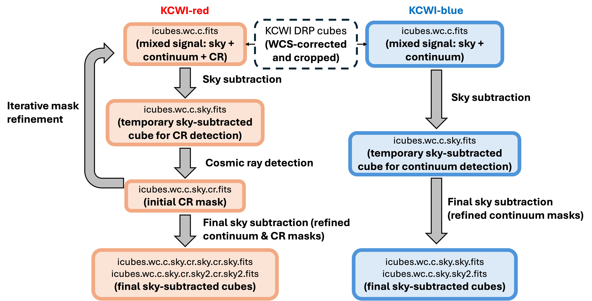

# kcwiulb

A Python package for ultra–low surface brightness IFU emission mapping with KCWI, developed during my PhD.

This pipeline has been used in several published works, including:

- Extensive diffuse Lyman-alpha emission correlated with cosmic structure  
  D. C. Martin et al. 2023, *Nature Astronomy*, 7, 1390  

- Kinematically Complex Circumgalactic Gas Around a Low-mass Galaxy: Filamentary Inflow and Counterrotation in J0910b  
  Z. Lin et al. 2025, *The Astrophysical Journal*, 995, 12  

A detailed description of the methodology is presented in  
*A Framework for Ultra--Low Surface Brightness IFU Emission Mapping with KCWI* (submitted to PASP).

---

## Installation

We recommend using a dedicated conda environment.

```bash
conda env create -f environment.yml
conda activate kcwiulb
pip install -e .
```

---

## Pipeline Overview

The kcwiulb pipeline processes KCWI data cubes through the following stages:

### Pre-processing
1. Generate file lists  
2. WCS correction  
3. Cube cropping  

### Sky Subtraction

The sky subtraction workflow differs significantly between the KCWI-blue and KCWI-red channels:



**Blue Channel**

4. Sky subtraction (iteration 1)  
5. Sky subtraction (iteration 2, multi-sky residual modeling)  

**Red Channel**

6. Sky subtraction with iterative cosmic-ray (CR) removal  
   - alternating sky subtraction and CR masking  
   - multiple iterations to decouple sky residuals and CR contamination  

### Coaddition
7. Coaddition (flux, variance, covariance products)  

### Post-processing / Analysis
8. WCS refinement (optional, on coadds)  
9. Spectral window selection (e.g., Hα region)  
10. Sky-line masking  
11. Stellar continuum / absorption removal  
12. PSF subtraction  
13. Background subtraction  
14. Source masking  
15. Adaptive smoothing / signal extraction  
16. Post-processing (e.g., denoising)

---

## Documentation

- [Folder Structure](docs/folder_structure.md)
- [Step 1: File Lists](docs/step1_master_filelists.md)
- [Step 2: WCS Correction](docs/step2_wcs.md)
- [Step 3: Cube Cropping](docs/step3_crop.md)

- **Step 4: Sky Subtraction**
  - Blue: [Iter 1](docs/step4_sky_blue_iter1.md), [Iter 2](docs/step4_sky_blue_iter2.md)
  - Red: [Sky Subtraction](docs/step4_sky_red.md)

- **Step 5: Coadd**
  - [Blue](docs/step5_coadd_blue.md), [Red](docs/step5_coadd_red.md)  
  ↳ *(Optional but highly recommended)*: [Covariance Test](docs/covariance_test.md)

- [Step 6: WCS Correction (Coadd)](docs/step6_coadd_wcs.md)

- [Step 7: Variance Normalization](docs/step7_variance_normalization.md)

**Example Analysis Flow**

- [Step 8: Spectral Window Selection](docs/step8_spectral_window.md)

- [Step 9: Low-Order Continuum Subtraction](docs/step9_continuum_subtraction.md)

  ↳ *(Optional but highly recommended)*: [Interactive Viewer](docs/interactive_viewer.md)

- [Step 10: Adaptive Smoothing](docs/step7_ads.md)

---

## License

This project is licensed under the MIT License.

If you use this code in your work, please cite the corresponding paper:
*A Framework for Ultra--Low Surface Brightness IFU Emission Mapping with KCWI* (submitted to PASP).


--- 

## Future Development

Several additional methods have already been developed and tested in standalone workflows, and will be incorporated into the pipeline in future releases:

1. **Batch WCS processing**  
   Batch processing will be implemented for efficiency. However, we strongly recommend inspecting each cube individually, as WCS solutions can vary significantly between exposures.

2. **WCS correction using KCWI guider images**  
   In fields without strong continuum sources, WCS alignment will be extended to use guider images. This will support both pre- and post-KCWI-red observations, as the KCWI guider systems differ significantly between these configurations.

3. **Residual sky subtraction for nod-and-shuffle data**  
   Additional refinement of sky subtraction for pre-KCWI-red nod-and-shuffle observations.

4. **Flexible cropping per exposure**  
   Allow per-cube cropping parameters to account for small shifts in detector alignment between observing runs. In practice, these shifts are typically at the level of ~1 pixel, but accommodating them improves consistency across nights.

5. **Wavelength solution refinement**  
   The KCWI DRP wavelength solution can exhibit small offsets relative to known sky lines. A correction step will be added during coaddition to improve wavelength calibration.

6. **Alternative coaddition with Monte Carlo error propagation**  
   An additional coadd mode will be implemented using Monte Carlo error propagation, avoiding explicit covariance matrix construction. This approach is particularly useful when:
   - wavelength axes differ significantly between cubes  
   - interpolation effects are complex  
   - a computationally lighter uncertainty estimate is desired  