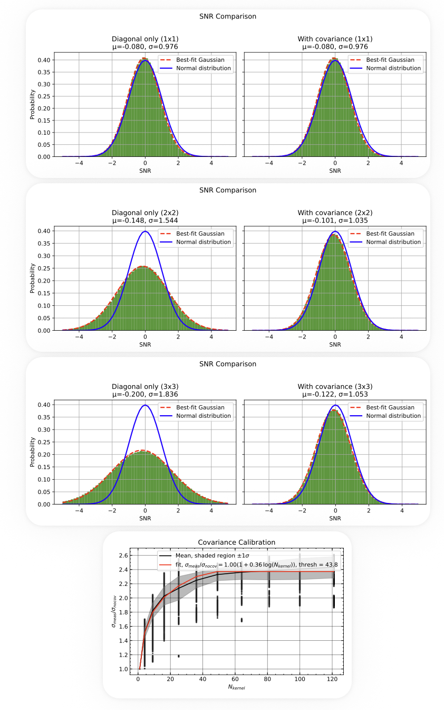

# Covariance Test

## Overview

This step validates the noise properties of the coadded cube by testing whether spatial covariance has been correctly propagated.

Although optional, it is **highly recommended** as a diagnostic step to verify that the signal-to-noise ratio (SNR) is properly normalized and that the coaddition pipeline produces statistically consistent results.

---

## Motivation

Interpolation and resampling during coaddition introduce **correlations between neighboring pixels**. If these correlations are not properly accounted for:

- The diagonal variance alone **underestimates the true noise**
- The measured SNR becomes **artificially inflated**
- Downstream analyses (e.g., detection thresholds, smoothing) can be biased

Modern IFU pipelines typically treat covariance through empirical calibration or approximate noise models (e.g., Husemann et al. 2013; Danforth et al. 2016; Law et al. 2016; O’Sullivan et al. 2020). In contrast, our coaddition propagates the full covariance matrix. This test therefore serves as a **direct validation** that the resulting noise model is statistically correct.

---

## Principle

For a correctly propagated noise model, the SNR distribution in blank sky regions should follow:

$\sigma \approx 1$

We compare two cases:

- **Full covariance** → expected to be correct  
- **Diagonal-only variance** → expected to underestimate noise  

The difference between the two provides a direct validation of covariance handling.

---

## Procedure

1. **Spatial rebinning**

   The cube is rebinned with increasing kernel sizes:

   N = 1×1, 2×2, ..., 11×11

2. **Wavelength selection**

   Selected wavelength ranges are used to avoid strong emission lines.

3. **Blank-sky masking**

   A sigma-clipped collapsed image identifies background-dominated regions.

4. **SNR measurement**

   For each kernel size:
   - Compute SNR using full covariance
   - Compute SNR using diagonal-only variance
   - Fit a Gaussian to each SNR distribution

---

## Running the Test

Run:

```text
python run_covariance_test.py
```

This script loads the coadded cube, rebins it over a range of kernel sizes, computes SNR distributions with and without covariance, and writes a diagnostic PDF.


---
### Configuration

Key parameters in `run_covariance_test.py`:

```python
# Output directory
OUTPUT_DIR = COADD_DIR  # saves results in the coadd folder

# Kernel sizes for spatial rebinning
KERNEL_SIZES = list(range(1, 4))  # e.g., 1×1 to 3×3

# Wavelength ranges used for SNR calculation (avoid emission lines)
COLLAPSE_WAVELENGTH_RANGES = [
    (3700, 3980),
    (4150, 5200),
]
```

---

## Output

The pipeline produces a PDF containing:

### 1. SNR Distributions (Primary Test)

For each kernel size:
- Left: diagonal-only SNR  
- Right: full covariance SNR  

Expected behavior:

- **Full covariance** → Gaussian with σ ≈ 1  
- **Diagonal-only** → σ < 1 (noise underestimated)

This directly demonstrates whether covariance has been correctly propagated.

---

### 2. Covariance Scaling (Secondary Diagnostic)

We also compute the ratio:

$\frac{\sigma_{\mathrm{measured}}}{\sigma_{\mathrm{nocov}}}$

and measure how it evolves with kernel size.

This provides a **quantitative description** of how covariance inflates the noise.

A simple model is fit:

$\frac{\sigma_{\mathrm{measured}}}{\sigma_{\mathrm{nocov}}}
= \mathrm{norm}(1 + \alpha \log N_{\mathrm{kernel}})$

This is useful for characterizing noise behavior but is **not required** for validation.

---

## Example Result



---

## Interpretation

- If full covariance gives σ ≈ 1 → ✅ noise is correctly propagated  
- If diagonal-only gives σ < 1 → expected underestimation of noise  
- If full covariance deviates from σ ≈ 1 → ❗ potential issue in coaddition  

A smooth increase in the noise ratio with kernel size indicates well-behaved covariance structure.

For a given instrument and coaddition strategy (e.g., KCWI sampling and interpolation scheme), the covariance scaling curve is expected to be largely **independent of the specific dataset**. Instead, it reflects the intrinsic correlation length set by the detector sampling and resampling/interpolation during coaddition.

Significant deviations between datasets may therefore indicate inconsistencies in the reduction or coaddition process rather than astrophysical differences.

---

## Notes

- Only **one off-diagonal covariance band** is stored for efficiency  
- Full covariance is reconstructed assuming symmetry  
- Off-diagonal terms are counted twice during rebinning  

---

## When to Use

This test is recommended when:

- Validating a new coaddition pipeline  
- Debugging noise properties  
- Comparing reduction strategies  
- Preparing results for publication  

---

## Summary

This step provides a **direct validation of noise propagation** by demonstrating that the SNR distribution is statistically consistent (σ ≈ 1) when full covariance is included.

It confirms that correlated noise introduced during coaddition is correctly handled, ensuring reliable SNR-based measurements.

The covariance scaling curve serves as a secondary diagnostic to characterize the impact of covariance on noise.