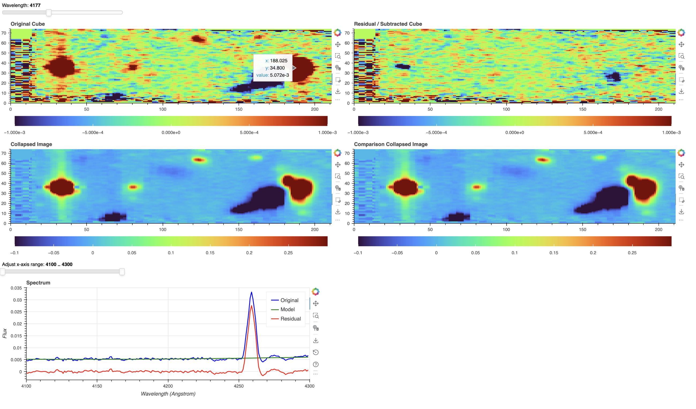
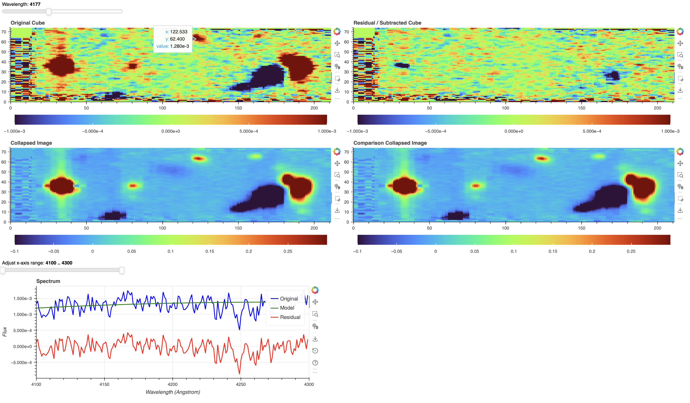
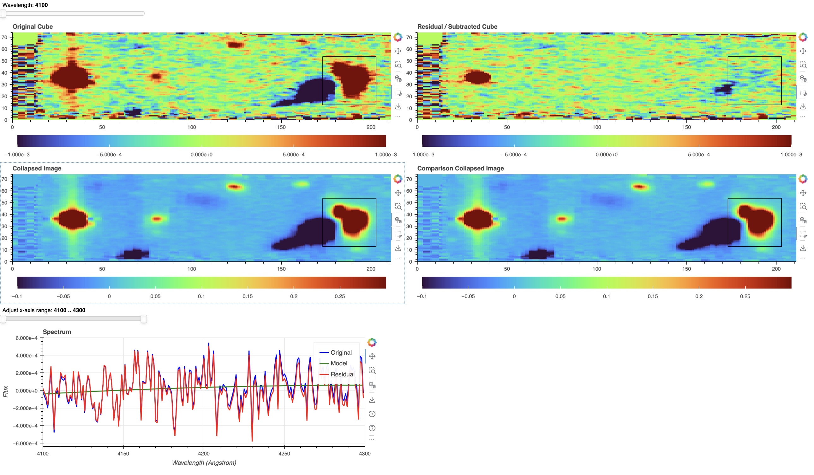

## Interactive KCWI Cube Viewer Documentation

I developed this interactive tool to inspect KCWI data cubes, including original flux, model, and residual (background/continuum-subtracted) cubes. It enables real-time spatial and spectral exploration for validating faint emission features and assessing subtraction quality.

The motivation for this tool arises from limitations in existing visualization software such as DS9, which is not well suited for direct, spaxel-by-spaxel comparison between the original data and various subtraction products (e.g., sky subtraction, continuum subtraction, or PSF modeling). In particular, efficiently examining spectral behavior across spatial regions and comparing multiple data cubes simultaneously is cumbersome in traditional tools. This viewer addresses these limitations by enabling synchronized spatial–spectral inspection and interactive region-based analysis.

---

### Features

#### 1. Multi-panel visualization

The interface includes:

- **Original Cube**: wavelength slice of the raw/coadded data  
- **Residual / Subtracted Cube**: background + PSF + continuum-subtracted data  
- **Collapsed Image**: wavelength-integrated image (excluding selected wavelength ranges)  
- **Comparison Collapsed Image (optional)**: alternate cube for comparison. For example, in paired science–background observations where sky subtraction is performed using a separate field, continuum sources from the background field can appear as negative features in the residual cube. Providing a comparison cube (e.g., a cube with only model sky subtraction) allows visualization of the intrinsic continuum structure in both fields and helps diagnose subtraction systematics.  
- **Spectrum Panel**: extracted spectrum from a selected spatial position or region  

---

#### 2. Wavelength navigation

- A **slider at the top** allows stepping through wavelength layers of the data cube  
- Both original and residual images update dynamically with wavelength  
- Useful for identifying emission features and assessing subtraction behavior across the spectral dimension  

---

#### 3. Spectral zoom

- A **range slider below the images** controls the wavelength range displayed in the spectrum panel  
- Enables detailed inspection of emission lines (e.g., [O II])  

---

#### 4. Interactive spectrum extraction

The spectrum panel updates dynamically based on user interaction with the image panels.

**Hover mode (default behavior)**  
- Moving the mouse over any image updates the spectrum  
- The extracted spectrum is computed from:
  - A single pixel, or  
  - A region defined by a box (if present)  
- This enables rapid, continuous exploration of spatial variations  

**Tap selection**  
- Clicking on a pixel extracts the spectrum at that exact location  

**Box selection (median spectrum)**  
- Activate the **Box Edit Tool** (rectangle icon in the toolbar)  
- Click and drag to define a region on any image panel  
- The spectrum is computed as the **median over all pixels in the selected region**  

---

### Typical Use Cases

**(1) Continuum subtraction at the target**  
  
- Inspect the residual cube at emission-line wavelengths  
- Confirm that emission is preserved while continuum is removed  
- The extracted spectrum shows a clear emission peak with minimal residual baseline  

---

**(2) Continuum subtraction near other sources**  
  
- Move to nearby continuum-dominated regions  
- Verify that subtraction removes stellar continuum cleanly  
- The spectrum should be noise-dominated without artificial features  

---

**(3) Box median extraction of extended emission**  
  
- Draw a box around extended emission regions  
- Extract the median spectrum within the selected region  
- Enhances detection of low surface brightness CGM structures  

---

### Controls Summary

- **Top slider** → change wavelength slice  
- **Bottom range slider** → adjust spectral window  
- **Mouse hover** → live spectrum update  
- **Click (tap)** → single-pixel spectrum  
- **Box Edit Tool** → region-based median spectrum  

---

### Notes

- Hover mode is enabled by default and remains active during box selection  
- Box selection is optional and enhances spectral extraction  
- The comparison panel is optional and only shown if a comparison cube is provided  

---

### Summary

This tool enables:
- Rapid identification of emission features  
- Validation of continuum and PSF subtraction  
- Exploration of spatially extended structures  
- Robust extraction of low signal-to-noise spectra  

It is particularly useful for confirming faint CGM emission in KCWI data and for diagnosing potential issues in the subtraction pipeline (e.g., sky, continuum, or PSF subtraction), particularly through direct spaxel-by-spaxel comparison, which enables identification of localized subtraction artifacts.