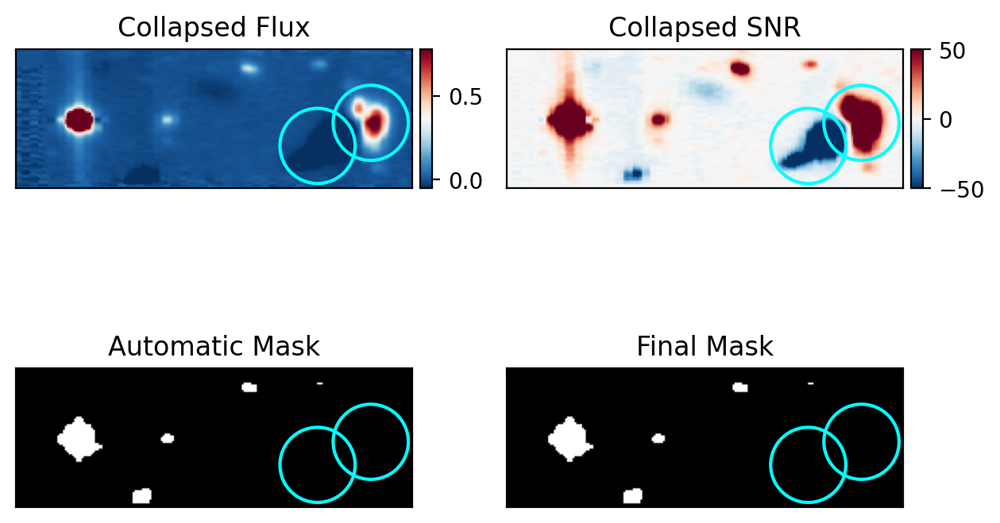

# Source Masking

## Overview

This step identifies and masks continuum sources in the field prior to adaptive smoothing.

It is applied after continuum subtraction to prevent high-SNR compact sources from biasing the smoothing of faint, extended emission.

---

## Principle

A continuum image is constructed by collapsing the cube while excluding the emission-line region.

Continuum sources are detected using sigma clipping on the collapsed image. The final mask preserves the science target and can be refined using user-defined spatial regions. *This design is specific to adaptive smoothing*, where the central target is intentionally kept unmasked so that its intrinsic flux and kinematic structure are not artificially smoothed, enabling clearer interpretation of the core region.

The mask is then applied to the background-subtracted cube.

---

## Procedure

- Collapse the cube excluding the emission-line region  
- Detect continuum sources using sigma clipping  
- Generate an automatic mask  
- Preserve the science target using a keep region  
- Optionally refine the mask with manual regions  
- Apply the mask to the background-subtracted cube  

---

## Running the Step

```
python run_source_mask.py
```

---

## Configuration

```
## Configuration

CHANNEL = "blue"  
GROUP = "a"  
PRODUCT = "sky"  
LABEL = "oii"  

LINE_MASK = (4240, 4275)  
SIGMA_CLIP_VALUE = 5.0  

# Regions to keep unmasked (typically the science target)
KEEP_CIRCLES = [
    ("sky", ra_deg, dec_deg, radius_pix),
    ("pixel", x_pix, y_pix, radius_pix),
]

# Optional refinement: restrict masking to selected regions
MANUAL_FILTER_CIRCLES = [
    ("pixel", x_pix, y_pix, radius_pix),
]

# Value assigned to masked pixels
MASKED_VALUE = 0.0
```

---

## Output

- Mask:
  `coadd_*.wc.<label>.mask.fits`

- Masked cube:
  `coadd_*.wc.<label>.bg.mask.fits`

- Diagnostic figure:
  `coadd_*.wc.<label>.mask_diagnostic.png`

Example diagnostic:



The diagnostic shows the collapsed continuum image, SNR map, automatic mask, and final mask. Cyan circles indicate preserved regions (e.g., the science target), while optional refinement regions are overlaid for mask control.

---

## Notes

- The mask is built from the original windowed cube but applied to the continuum-subtracted cube  
- Manual refinement is useful for irregular or misaligned sources  
- Users are encouraged to inspect the diagnostic figure to verify masking quality  