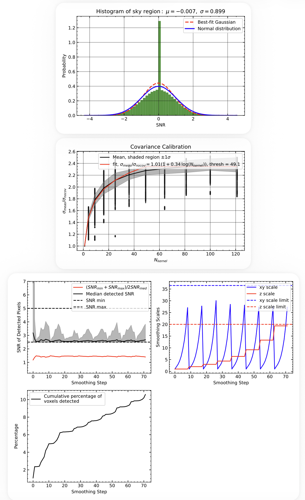

# Adaptive Smoothing (ADS)

## Overview

This step extracts ultra–low surface brightness emission from the data cube produced by the preceding analysis steps
(e.g., spectral window selection, continuum subtraction, background removal, and source masking).

The method combines:
- spatial and spectral smoothing  
- empirical covariance calibration  
- SNR-based detection  

to recover faint, extended emission while preserving statistical validity.

Unlike fixed-kernel smoothing, ADS adapts the smoothing scale locally to achieve a target signal-to-noise ratio (SNR), enabling robust detection across a wide dynamic range.

---

## Motivation

Detecting diffuse CGM emission requires:

- maximizing sensitivity to faint structures  
- avoiding artificial boosting of noise  
- preserving statistical interpretability of SNR  

However:

- fixed smoothing kernels either over-smooth bright regions or miss faint emission  
- ignoring covariance leads to overestimated SNR  
- naive smoothing introduces scale-dependent biases  

ADS addresses these issues by:

- adapting kernel size based on local SNR  
- correcting variance using a data-driven covariance calibration  
- enforcing consistent detection thresholds across scales  

---

## Principle

The ADS workflow consists of three stages:

### 1. Variance Validation (SNR Check)

A blank-sky SNR test is performed using:

- wavelength-restricted regions  
- sigma-clipped spatial masking  

Expected behavior:

$\sigma_{\mathrm{SNR}} \approx 1$

This ensures that the propagated variance is correctly normalized before detection.

---

### 2. Covariance Calibration

Spatial smoothing introduces correlated noise.

The covariance scaling is measured following the same procedure as described in the covariance test:

[Covariance Test](covariance_test.md)

This calibration is then used to correct the variance during adaptive smoothing.

---

### 3. Adaptive Smoothing Detection

The cube is iteratively smoothed in both spatial and spectral dimensions, with kernel sizes adjusted dynamically based on the local SNR properties of the data.

At each iteration:

- the cube is smoothed spatially and spectrally  
- the SNR is computed using covariance-corrected variance  
- significant voxels are identified and recorded  
- detected signal is subtracted from the working cube  

The smoothing scales are updated adaptively to reach the target SNR range while avoiding both under- and over-smoothing.

A full description of the adaptive smoothing algorithm, including the control scheme, convergence behavior, and statistical validation, is presented in:

*A Framework for Ultra–Low Surface Brightness IFU Emission Mapping with KCWI* (submitted to PASP)

as well as:

Lin et al. (2025, ApJ), Section: "Adaptive Smoothing and Signal Detection"

---

## Procedure

1. **Load coadded products**
   - flux cube  
   - variance cube  
   - covariance products  

2. **Run SNR verification**
   - apply wavelength mask  
   - sigma-clip spatially  
   - compute SNR distribution  

3. **Fit covariance scaling**
   - evaluate kernel sizes (e.g., 1–11)  
   - compute variance ratios  
   - fit logarithmic scaling relation  

4. **Run ADS detection loop**
   - iterate over spatial and spectral kernels  
   - detect significant voxels  
   - track detection statistics  

5. **Write outputs and diagnostics**

---

## Running ADS

Run:

```bash
python run_ads.py
```

The script will:

1. Display the **SNR histogram** (close window to continue)  
2. Display the **covariance calibration plot** (close window to continue)  
3. Run the full ADS detection  
4. Save outputs and diagnostics  

---

## Configuration

Key parameters in `run_ads.py`:

```python
SNR_MIN = 2.5          # SNR threshold for adaptive stepping
SNR_MAX = 2 * SNR_MIN  

XY_RANGE = (1, 50)     # spatial smoothing range (pixels)
XY_STEP = 1            # initial spatial step
XY_STEP_MIN = 1        # minimum spatial step

Z_RANGE = (1, 20)      # spectral smoothing range (pixels)
Z_STEP = 1             # initial spectral step
Z_STEP_MIN = 1         # minimum spectral step

KERNEL_TYPE = "box"    # "box" or "gaussian"

DIAGNOSTIC_WAVELENGTH_RANGES = [
    (4100, 4240),
    (4275, 4300),
]  # blank-sky regions for SNR and covariance calibration
```

---

## Output

### FITS Products

- `*.ads.fits` → detected flux cube  
- `*.mask.fits` → detection mask  
- `*.snr.fits` → SNR cube  
- `*.kernelr.fits` → spatial kernel per voxel  
- `*.kernelw.fits` → spectral kernel per voxel  

---

### Diagnostics PDF

A multi-page PDF is generated containing the following diagnostic plots.  
An example is available here:



#### 1. SNR Verification

- Histogram of blank-sky SNR  
- Gaussian fit (μ, σ)

Expected:

- μ ≈ 0  
- σ ≈ 1  

---

#### 2. Covariance Calibration

- Scatter of variance ratios  
- Mean ±1σ trend  
- Best-fit scaling relation  

This quantifies how covariance inflates the noise as a function of kernel size.

---

#### 3. ADS Process

- SNR evolution during detection  
- Spatial and spectral kernel growth  
- Fraction of detected voxels  

We **strongly recommend** inspecting these diagnostics to verify that the smoothing parameters are chosen appropriately.

In particular:

- The **SNR evolution panel** should show stable behavior, with the median detected SNR remaining close to the target range between `SNR_min` and `SNR_max`.  
- The **kernel growth panel** should show smooth, controlled increases in spatial and spectral scales without erratic jumps or premature saturation at the limits. 
- If the spatial kernel rapidly reaches the maximum value (`XY_RANGE[1]`), the detection threshold may be too high or the data may be noise-dominated.   

Deviations from these behaviors may indicate that the smoothing ranges or step sizes need adjustment.

---

## Summary

Adaptive smoothing provides a statistically robust method to detect faint emission by combining:

- validated noise normalization  
- empirical covariance correction  
- adaptive, scale-dependent detection  

It is a key step enabling ultra–low surface brightness science with KCWI.