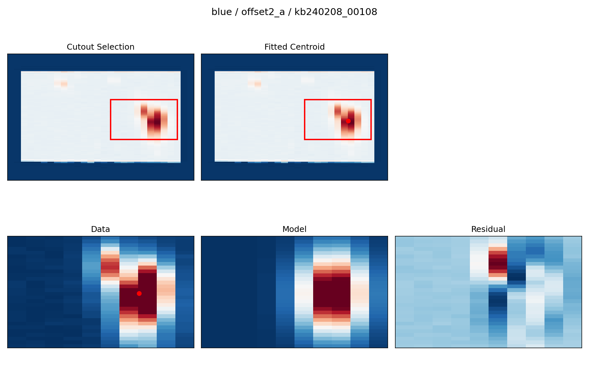

## Second Step: WCS Correction

The next step in the pipeline is to determine the absolute WCS by fitting a reference continuum source in each cube.

Run:

```bash
python run_wcs_one.py
```

---

### Example Settings

Edit the script:

```text
FIELD = "offset2_a"
CUBE_ID = "kb240208_00108"
CHANNEL = "blue"

WRITE_OUTPUT = False
```

---

### Output

WCS-corrected cubes:

```text
{channel}/{field}/{cube_id}_icubes.wc.fits
```

The corrected cubes are written to the same directory as the original `*_icubes.fits` files, with the `.wc.fits` suffix appended.

---

### Diagnostic Plots

Diagnostic plots:

```text
diagnostics/{channel}/{field}/{cube_id}_wcsfit.png
```

Each diagnostic figure includes:
- Cutout selection (location of fitting region)
- Fitted centroid (global position after alignment)
- Data / model / residual comparison (fit quality)



This example shows a successful WCS fit, including the selected fitting region, the recovered centroid position, and the quality of the Gaussian model fit.

---

### Parameter Tuning

Default parameters are defined in:

```text
WCS_FIELDS[CHANNEL][FIELD]
```

You can override parameters for individual cubes:

```text
OVERRIDES = {
    "amplitude_init": 200,
    "x_mean_init": 7,
}
```

---

### Workflow

1. Run one cube  
2. Inspect the diagnostic plot  
3. Adjust parameters if needed  
4. Enable `WRITE_OUTPUT = True`  
5. Repeat for all cubes  

---

### Notes

- Blue and red channels require separate configurations  
- Initial guesses may vary significantly between fields  
- Always inspect the diagnostic plots before saving results  

This step currently uses continuum sources directly detected in the KCWI cubes for WCS alignment.

In fields without a strong continuum source, a future release will include an alternative method that uses continuum sources identified in the corresponding guider images.

Because the WCS solution critically affects all downstream processing, we strongly recommend running this step **one cube at a time** and verifying that each fit is correct before proceeding.