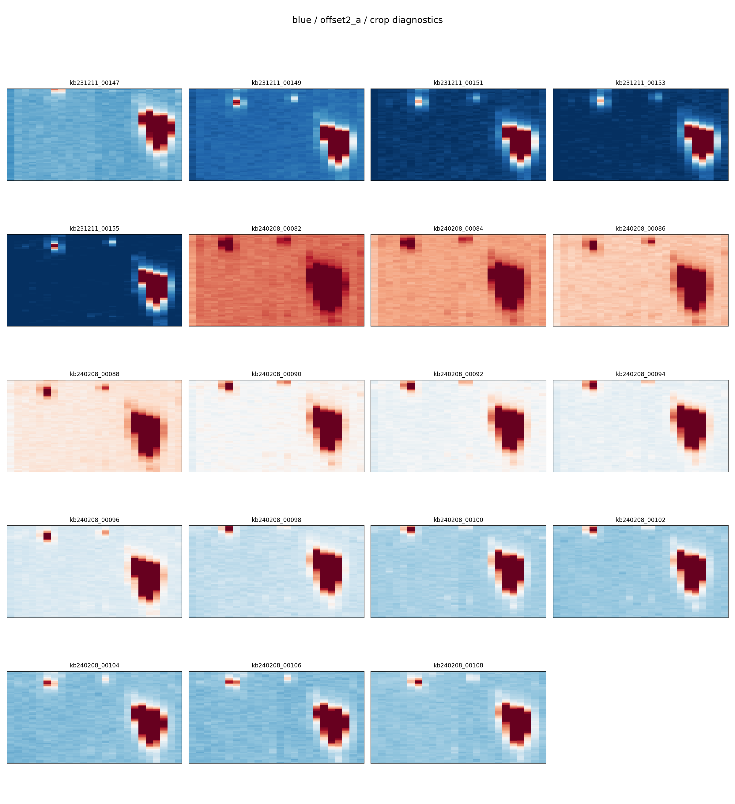

## Cube Cropping

The next step is to crop the data cubes to remove detector edge regions and restrict the wavelength range.

KCWI slices are staggered, and the DRP output cubes contain empty or low-quality regions at the edges. This step removes those regions and ensures a consistent spatial and spectral footprint across all exposures.

Run:

```bash
python run_crop_batch.py
```

---

### Crop Configuration

Cropping parameters are defined separately for the blue and red channels:

```python
CROP_FIELDS = {
    "blue": {
        "xcrop": (2, 26),
        "ycrop": (17, 80),
        "wav_crop": (3652.0, 5675.0),
        "diag_wav_ranges": [(3700, 3980), (4150, 5200)],
    },
    "red": {
        "xcrop": (2, 26),
        "ycrop": (12, 78),
        "wav_crop": (6879.0, 8166.0),
        "diag_wav_ranges": [(7020, 7030), (7100, 7120)],
    },
}
```

- `xcrop`, `ycrop`: spatial cropping ranges (pixels)  
- `wav_crop`: continuous wavelength range used for the final cropped cube  
- `diag_wav_ranges`: wavelength segments used only for diagnostic visualization  

---

### Wavelength Selection

The valid wavelength range varies slightly between exposures and is recorded in the FITS headers:

```text
WAVGOOD0, WAVGOOD1
```

During execution, the script prints:

```text
WAVGOOD range: 3650.75 – 5675.93
```

This provides guidance for selecting `wav_crop`. We recommend choosing values slightly inside this range (rounded to integer Angstroms) to ensure robust trimming.

---

### Output

Cropped cubes:

```text
{channel}/{field}/{cube_id}_icubes.wc.c.fits
```

These are written alongside the WCS-corrected cubes, with the `.c.fits` suffix.

The cropping is applied consistently to:
- the science cube (HDU 0)
- the uncertainty cube (HDU 1), if present
- any additional 3D extensions with matching shape

---

### Diagnostic Plots

For each field, a diagnostic figure is generated:

```text
diagnostics/{channel}/{field}/{field}_crop.png
```

Each figure shows:
- collapsed images of all cubes in the field  
- wavelength-collapsed signal using `diag_wav_ranges`  
- consistent color scaling across panels  
- 4 panels per row  

These plots are useful for verifying:
- spatial alignment  
- successful edge trimming  
- data quality consistency across exposures  



---

### Notes

- Cropping parameters differ between the blue and red channels because they use two different detectors  
- The same parameters are applied across all subfields within a channel, although they may vary slightly between observing runs if the instrument configuration changes  
- Always inspect diagnostic plots before proceeding to further processing
