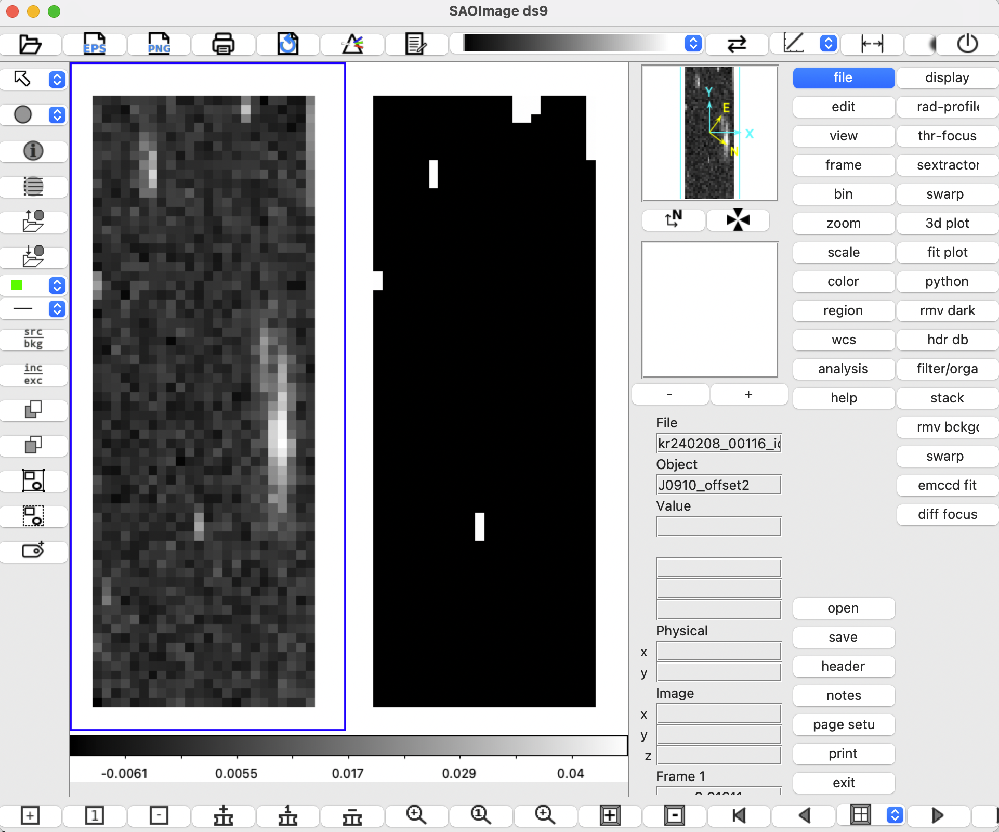

## Cosmic Ray Identification and Masking (Red, after Iteration 1)

After the initial red-channel sky subtraction, the next step is to identify and mask cosmic rays before recomputing the sky subtraction.

This step is necessary because the red-channel continuum masks used in Iteration 1 can be affected by cosmic ray contamination, which biases the median sky spectra and the fitted sky model.

---

### Purpose

The goal of this step is to generate a cosmic ray mask for each red sky-subtracted cube:

```text
{cube_id}_icubes.wc.c.sky.cr.fits
```

Each output file contains:

- the original sky-subtracted flux cube  
- the corresponding uncertainty cube  
- a cosmic ray mask cube (`CRMASK`)  

The input flux is not modified at this stage; only the mask is produced.

---

### Method Overview

Cosmic rays are identified by comparing overlapping spectra from multiple cubes projected onto a common spatial grid.

For each pixel in the common WCS plane:

1. overlapping spectra are collected from all contributing input cubes  
2. a median comparison spectrum is constructed  
3. voxels are flagged as cosmic rays when they exceed:

```text
median + ALPHA × sigma
```

where `sigma` is estimated from the propagated uncertainties of the contributing spectra.

This approach is similar in spirit to the coadd step, as it uses the same common-grid overlap logic.

---

### Run Cosmic Ray Identification and Masking

```bash
python run_cr_red_iter1.py
```

---

### Inputs

This step uses the red Iteration 1 sky-subtracted cubes as input:

```text
{cube_id}_icubes.wc.c.sky.fits
```

These are grouped by field suffix (for example `a`, `b`, etc.) and compared jointly within each group.

---

### Main Parameters

The main user-configurable parameters are defined in:

```text
scripts/run_cr_red_iter1.py
```

Key settings include:

```python
PA = 125
ALPHA = 3.0  # sigma threshold; lower = more aggressive masking (recommended for initial CR identification)
PX_THRESH = 0.1
```

where:

- `PA` sets the position angle used to define the common WCS grid  
- `ALPHA` controls the aggressiveness of cosmic ray identification  
- `PX_THRESH` is the minimum overlap threshold for including a contributing pixel  

Lower `ALPHA` values result in more aggressive masking, while higher values are more conservative.

---

### Output Location

By default, the cosmic ray mask files are written alongside the input sky-subtracted cubes.

For example:

```text
red/{field}/{cube_id}_icubes.wc.c.sky.cr.fits
```

This keeps the outputs local to each field and preserves the per-cube pipeline sequence:

```text
...c.fits → ...sky.fits → ...sky.cr.fits
```

---

### Notes

- This step performs cosmic ray identification and masking only; it does not recompute the sky subtraction  
- The resulting masks are used in the next iteration to improve continuum masking and sky estimation  
- Keeping this step separate makes it easier to inspect and debug cosmic ray identification before proceeding  
- We recommend opening the first (flux) and third (CRMASK) extensions of the `.cr.fits` file in DS9 (or similar) to verify that bright, compact features are correctly flagged  

Example inspection:



Since this is the initial (Iteration 1) masking step, the result is not expected to be fully clean; remaining artifacts will be refined in later iterations.