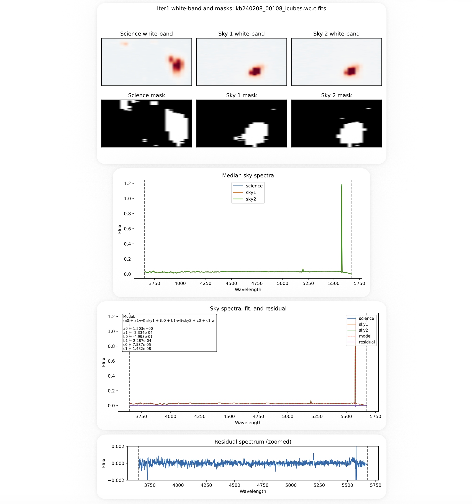

## Sky Subtraction (Blue, Iteration 1)

The next step is to perform sky subtraction using a two-sky fitting model optimized for ultra–low surface brightness emission.

This step uses precomputed sky mappings to associate each science cube with appropriate sky exposures.

---

### Generate Sky Map (Iteration 1)

First, generate the sky mapping file:

```text
python generate_sky_map_blue_iter1.py
```
This produces:

```text
sky_map_blue_iter1.txt
```

Each entry specifies:

```text
science | sky1 | sky2
```

with skies selected from the paired offset field (e.g., `offset2_a` uses skies from `offset2_b`) and matched by observing date and frame proximity.

Users are encouraged to review and edit this file if needed before proceeding.

---

### Run Sky Subtraction

Run the batch sky subtraction:

```text
python run_sky_blue_iter1.py
```

---

### Model Description

For each science cube, the sky is modeled as:

`(a0 + a1 * λ) * sky1 + (b0 + b1 * λ) * sky2 + c0 + c1 * λ`

where:
- sky1, sky2 are adjacent sky exposures  
- coefficients allow for wavelength-dependent scaling  
- a low-order polynomial accounts for residual background structure  

The model is fit to the data using least-squares optimization.

---

### Output

Sky-subtracted cubes:

```text
{channel}/{field}/{cube_id}_icubes.wc.c.sky.fits
```

These are written alongside the cropped cubes.

---

### Diagnostic Plots

For each cube, a multi-page diagnostic PDF is generated:

```text
diagnostics/{channel}/{field}/{cube_id}_sky_iter1.pdf
```

Each file includes:

1. White-band images of science and sky cubes with masks  
2. Median spectra of science and sky exposures  
3. Sky model fit, residuals, and fitted parameters  
4. Zoomed residual spectrum within the valid wavelength range  

These diagnostics are critical for assessing:
- sky selection quality  
- fit stability  
- residual systematics  

Example diagnostic:



---

### Single-Cube Debug Mode

For detailed inspection, a single-cube script is provided:

```text
python run_blue_iter1_single.py
```

This allows:
- testing individual sky combinations  
- rapid iteration on problematic exposures  
- focused inspection of diagnostic plots  

---

### Notes

- Sky exposures are selected from the paired offset field to avoid contamination from the science target  
- Only exposures with matching date codes are used to ensure consistent sky conditions  
- Always inspect diagnostic PDFs before proceeding to further processing  
- This is the first iteration of sky subtraction; a second iteration refines residuals using additional sky exposures  