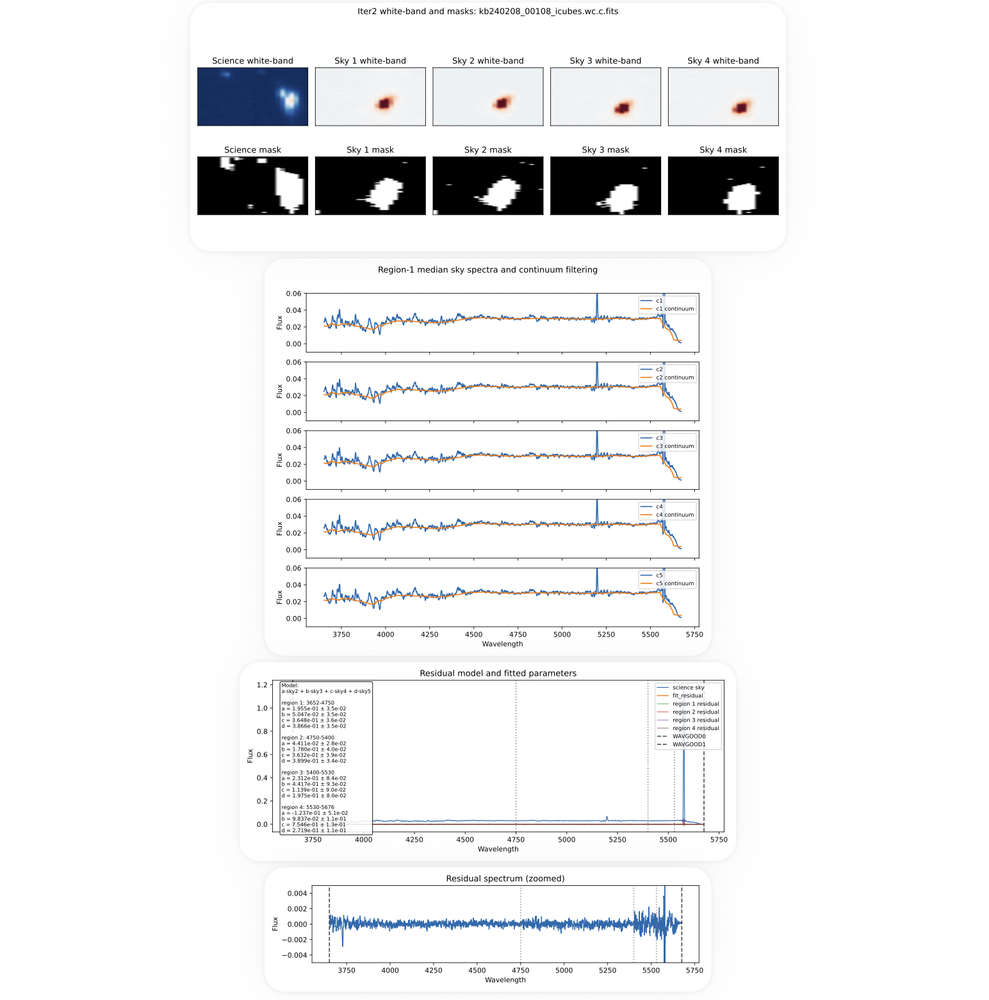

## Fourth Step: Sky Subtraction (Blue, Iteration 2)

The second iteration of sky subtraction refines the results from Iteration 1 using a multi-sky residual modeling approach. This step is designed to further suppress systematic sky residuals and improve performance for ultra–low surface brightness emission.

A key feature of Iteration 2 is that it treats the sky continuum and sky-line residuals separately, rather than modeling the sky as a single component. This separation is important because the smooth sky continuum and the narrow atmospheric emission lines vary differently in time and contribute differently to the residual structure. The continuum is first removed using a weighted median filter, and the remaining line-dominated residual spectrum is then fit using a linear combination of multiple sky exposures. This component-separated approach is one of the main improvements of the second iteration.

Iteration 2 therefore introduces:
- four-sky modeling  
- continuum-filtered residual fitting  
- separation of sky continuum and sky-line residuals  
- optional wavelength-dependent region fitting  

---

### Generate Sky Map (Iteration 2)

First, generate the sky mapping file:

    python generate_sky_map_blue_iter2.py

This produces:

    sky_map_blue_iter2.txt

Each entry specifies:

    science | sky1 | sky2 | sky3 | sky4

with skies selected from the paired offset field and matched by observing date and frame proximity.

Users are encouraged to review and edit this file if needed before proceeding.

---

### Run Sky Subtraction (Batch Mode)

Run the batch sky subtraction:

    python run_sky_blue_iter2.py

This processes all science cubes listed in the sky map.

---

### Model Description

Iteration 2 operates on continuum-subtracted residual spectra and models the sky as:

    a · sky2 + b · sky3 + c · sky4 + d · sky5

where:
- sky2–sky5 are four sky exposures  
- coefficients (a, b, c, d) are fitted independently in each wavelength region  
- fitting is performed on median residual spectra after continuum filtering  

The continuum is removed using a weighted median filter, isolating emission-line residuals before fitting.

---

### Flexible Wavelength Regions (User-Configurable)

Users can optionally split the wavelength range into multiple fitting regions by editing:

    SPLIT_WAVELENGTHS = [4750, 5400, 5530]

This defines internal wavelength boundaries between:
- start = WAVGOOD0 + margin  
- end   = WAVGOOD1  

The motivation for this segmentation follows the general approach of Soto et al. (2016), who divided the sky spectrum into wavelength intervals associated with different atmospheric components, since sky emission features of different origin can vary differently in time. In particular, atomic lines such as [O I] and molecular OH bands do not necessarily evolve together, so fitting the full spectrum as a single component can leave systematic residuals. Splitting the wavelength range into separate regions allows the sky-line residual model to adapt to these different atmospheric regimes and usually improves subtraction stability.

Examples:

    None or []              → single fit region  
    [5530]                  → two regions  
    [4750, 5400, 5530]      → four regions  

This allows:
- improved modeling of wavelength-dependent sky behavior  
- flexibility for different spectral setups  
- better handling of regions with strong sky features  

---

### Output

Two sky-subtracted cubes are produced:

    {cube_id}_icubes.wc.c.sky.sky.fits     (per-spaxel residual subtraction)
    {cube_id}_icubes.wc.c.sky.sky2.fits    (median residual subtraction)

These are written alongside the input cubes.

---

### Diagnostic Plots

For each cube, a multi-page diagnostic PDF is generated:

    diagnostics/{channel}/{field}/{cube_id}_sky_iter2.pdf

Each file includes:

1. White-band images of science and sky cubes with masks  
2. Median sky spectra with continuum filtering  
3. Residual model and fitted parameters for each wavelength region  
4. Zoomed residual spectrum  

These diagnostics are critical for assessing:
- sky combination quality  
- continuum subtraction performance  
- fit stability across wavelength regions  
- residual systematics  

Example diagnostic:

---

### Single-Cube Debug Mode

For detailed inspection, a single-cube script is provided:

    python run_sky_subtraction_iter2_one.py

This allows:
- testing individual sky combinations  
- experimenting with different split wavelengths  
- rapid debugging of problematic exposures  
- focused inspection of diagnostic plots  

---

### Notes

Iteration 2 requires Iteration 1 outputs:

    *_icubes.wc.c.sky.fits

The method is optimized for:
- faint diffuse emission  
- minimizing large-scale sky residuals  
- preserving low surface brightness structure  

The flexible wavelength-region fitting is particularly useful for:
- KCWI-blue data with varying sky structure  
- regions affected by strong atmospheric features  
