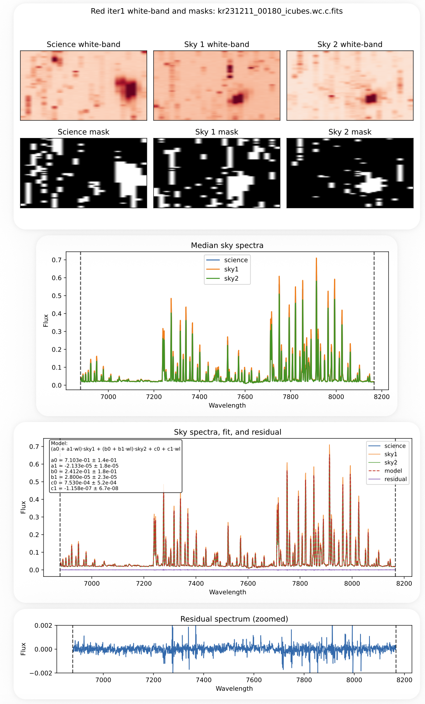

## Sky Subtraction (Red, Iteration 1)

Sky subtraction for the red channel follows the same procedure as the blue channel (Iteration 1), using a two-sky fitting model with wavelength-dependent scaling.

For a full description of the method, see:

**[Sky Subtraction (Blue, Iteration 1)](step4_sky_blue_iter1.md)**

---

### Generate Sky Map (Iterations 1–2)

First, generate the sky mapping file:

```text
python generate_sky_map_red_iter12.py
```

This produces:

```text
sky_map_red_iter12.txt
```

Each entry specifies:

```text
science | sky1 | sky2
```

Sky exposures are selected based on:
- paired offset field (`a ↔ b`)  
- matching observing date  
- proximity in frame number  
- fallback to other fields on the same nodding side if needed  

---

### Run Sky Subtraction

```text
python run_sky_red_iter1.py
```

---

### Key Difference: Cosmic Rays

Unlike the blue channel, the red data contain significant cosmic ray contamination.

These cosmic rays affect:
- white-band images  
- sigma-clipping masks  
- median sky spectra used in the fit  

As a result, masking at this stage may include cosmic ray artifacts, which can impact the sky model.

---

### Iterative Strategy

Sky subtraction for the red channel is performed in multiple stages:

1. **Iteration 1 (this step)**  
   - Initial sky subtraction using two skies  
   - Masks may be contaminated by cosmic rays  

2. **Cosmic Ray Masking (next step)**  
   - Detect and mask cosmic rays in the sky-subtracted cubes  

3. **Refined Iteration (later step)**  
   - Recompute masks using cleaned data  
   - Perform improved sky subtraction  

---

### Wavelength Selection

White-band masks and median spectra are constructed using:

```text
7000–7200 Å and 7400–7800 Å
```

---

### Output

Sky-subtracted cubes:

```text
{channel}/{field}/{cube_id}_icubes.wc.c.sky.fits
```

---

### Diagnostic Plots

For each cube, a multi-page diagnostic PDF is generated:

```text
diagnostics/{channel}/{field}/{cube_id}_sky_iter1.pdf
```

Each file includes:

1. White-band images of science and sky cubes with masks  
2. Median spectra of science and sky exposures  
3. Sky model fit, residuals, and fitted parameters  
4. Zoomed residual spectrum  

These diagnostics are essential for:
- verifying sky selection  
- identifying cosmic ray contamination  
- evaluating subtraction quality  

Example diagnostic:



---

### Notes

- Imperfect subtraction at this stage is expected due to cosmic rays  
- Always inspect diagnostic PDFs before proceeding  
- The cosmic ray masking step is critical for improving subsequent iterations  