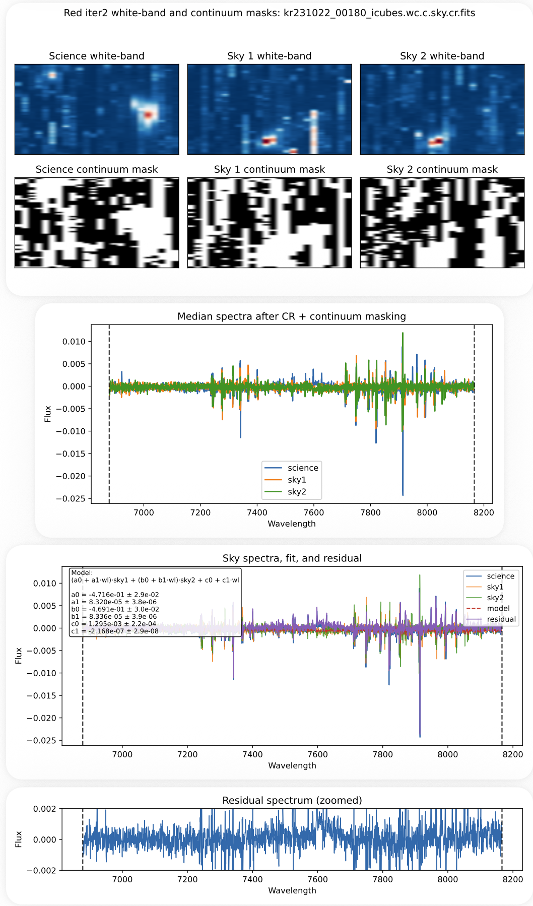

## Sky Subtraction (Red, Iteration 2)

This step recomputes the sky subtraction using cosmic ray masks from the previous step to improve continuum masking and sky estimation.

For the general method and sky model, see:

**[Sky Subtraction (Red, Iteration 1)](step4_sky_red_iter1.md)**

---

### Run Sky Subtraction (Iteration 2)

```bash
python run_sky_red_iter2.py
```

---

### Key Improvement: Cosmic Ray–Aware Masking

In Iteration 2, the continuum masks are recomputed using the cosmic ray masks from:

```text
{cube_id}_icubes.wc.c.sky.cr.fits
```

This improves:

- white-band images used for masking  
- sigma-clipping masks  
- median sky spectra used in the fit  

By removing cosmic ray contamination, the sky model becomes more stable and representative of the true background.

---

### Inputs

This step uses the cosmic ray–masked cubes from the previous step:

```text
{cube_id}_icubes.wc.c.sky.cr.fits
```

---

### Output

This step produces intermediate sky-subtracted cubes:

```text
{cube_id}_icubes.wc.c.sky.cr.sky.fits
{cube_id}_icubes.wc.c.sky.cr.sky2.fits
```

- `.sky.fits` — spaxel-wise sky subtraction  
- `.sky2.fits` — median-based sky subtraction  

These outputs are used to improve the next iteration of cosmic ray identification and are not final science products.

---

### Diagnostic Plots

For each cube, a multi-page diagnostic PDF is generated:

```text
diagnostics/{channel}/{field}/{cube_id}_sky_iter2.pdf
```

These diagnostics include:

1. White-band images and updated masks (with CR masking applied)  
2. Median spectra and continuum filtering  
3. Sky model fit and residuals across wavelength regions  
4. Zoomed residual spectrum  

These plots are essential for verifying:

- improved masking quality  
- stability of the sky model  
- reduction of cosmic ray artifacts  

Example diagnostic:

<p align="center">
  
</p>

---

### Single-Cube Debug Mode

For detailed inspection, a single-cube script is provided:

```bash
python run_sky_red_iter2_one.py
```

This allows:

- testing individual sky combinations  
- verifying the impact of cosmic ray masking  
- inspecting diagnostic plots interactively  

---

### Notes

- This step recomputes the sky subtraction from the **original (unsubtracted) cube** using masks improved by the previous cosmic ray identification step   
- The output of this step is **not used as a final product**, but only to improve the next round of cosmic ray masking  
- Each iteration restarts from the original data; sky-subtracted cubes are not chained between iterations  
- Only the final iteration produces the sky-subtracted cube used for scientific analysis  
- Residual artifacts are expected at this stage and will be reduced in later iterations  
- Always inspect diagnostic PDFs before proceeding  
- This step feeds directly into the next cosmic ray identification and masking iteration  