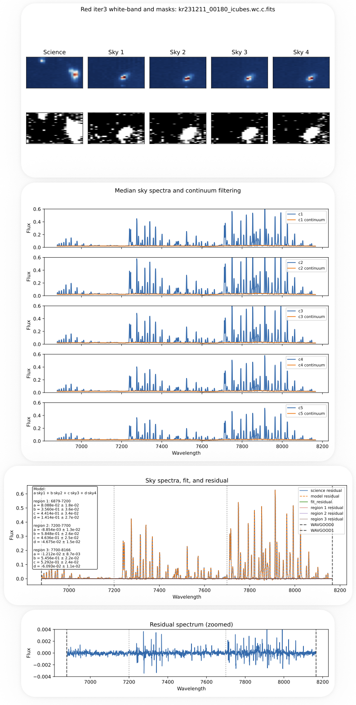

## Sky Subtraction (Red, Iteration 3)

This step performs the **final sky subtraction**, using improved masking and **region-based multi-sky residual modeling**.

For the general method, see:

**[Sky Subtraction (Red, Iteration 1)](step4_sky_red_iter1.md)**

---

### Run Sky Subtraction

```bash
python run_sky_red_iter3.py
```

---

### Method Overview

Iteration 3 builds on Iteration 2 by fitting the sky residuals using **multiple sky exposures** and **splitting the spectrum into wavelength regions**.

The model in each region is:

```text
model = a·sky1 + b·sky2 + c·sky3 + d·sky4
```

- Four sky exposures are used  
- Coefficients are fitted **independently in each wavelength region**  
- Fitting is performed on **continuum-filtered residual spectra**  

This improves:

- subtraction near strong sky lines  
- handling of wavelength-dependent sky variations  
- overall residual stability  

> **Note:** As in **[Sky Subtraction (Blue, Iteration 2)](step4_sky_blue_iter2.md)**, this step separates the sky continuum and emission-line residuals before fitting.  
>  
> - The continuum is first estimated and removed  
> - The remaining line-dominated residual is modeled using multiple sky exposures  
> - The smooth continuum and narrow atmospheric emission lines **do not evolve in the same way**, so modeling them jointly introduces systematics  
>  
> Treating these components independently is a key part of the method used in this work.

---

### Inputs

Original unsubtracted cubes:

```text
{cube_id}_icubes.wc.c.fits
```

CR-masked products used for mask construction:

```text
{cube_id}_icubes.wc.c.sky.cr.sky2.cr.fits
```

Sky mapping file:

```text
sky_map_red_iter3.txt
```

Each entry:

```text
science | sky1 | sky2 | sky3 | sky4
```

---

### Output

Two sky-subtracted cubes:

```text
{cube_id}_icubes.wc.c.sky.cr.sky.cr.sky.fits
{cube_id}_icubes.wc.c.sky.cr.sky2.cr.sky2.fits
```

- `.sky.cr.sky.cr.sky.fits` — per-spaxel subtraction  
- `.sky.cr.sky2.cr.sky2.fits` — median-based subtraction  

These are the **final science products**.

---

### Diagnostic Plots

Generated for each cube:

```text
diagnostics/{channel}/{field}/{cube_id}_sky_iter3.pdf
```

Includes:

1. White-band images and masks  
2. Median spectra and continuum filtering  
3. Residual model and fitted parameters  
4. Zoomed residual spectrum  

Use these to verify:

- masking quality  
- fit stability  
- residual suppression  

Example diagnostic:

<p align="center">
  
</p>


---

### Single-Cube Debug Mode

```bash
python run_sky_red_iter3_one.py
```

Useful for:

- testing individual cubes  
- inspecting region-based fits  
- debugging problematic cases  

---

### Notes

- This is the **final sky subtraction iteration** prior to coaddition and is the only subtraction applied to the original cube for scientific analysis  
- Earlier iterations are used exclusively to improve **cosmic ray (CR) masking** and are not propagated into the final product  
- Fitting is performed **per wavelength region**, rather than with a single global model  