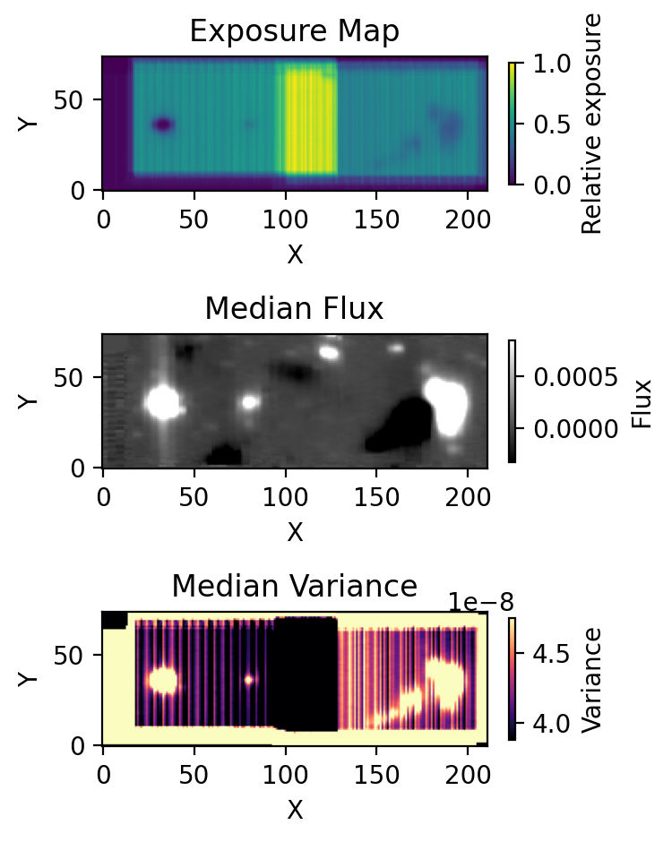

## Coaddition (Blue)

After sky subtraction, the next step is to coadd the blue-channel data cubes onto a common spatial grid.

This step combines all selected exposures within a given target group into a single coadded cube, while explicitly propagating both the variance and the interpolation-induced covariance. Because the cubes are aligned using refined WCS solutions and resampled onto a shared output frame, neighboring output pixels are no longer statistically independent. The coaddition step therefore tracks not only the flux and variance cubes, but also the sparse covariance structure required for later uncertainty propagation.

A key feature of this step is that the coaddition is flexible and user-controlled. The user specifies which sky product to use (`sky` or `sky2`), the position angle (`PA`), and the pixel threshold (`PX_THRESH`), as well as which exposures should be included or excluded from the coadd.

The coaddition procedure consists of:
- WCS alignment and construction of a common output grid  
- interpolation of each input cube onto the coadd grid  
- accumulation of flux weighted by exposure time  
- propagation of variance through the interpolation kernel  
- construction of sparse covariance arrays for neighboring pixels  
- normalization by total exposure time  

---

### Run Coaddition

Run the coadd script:

    python run_coadd_blue.py

---

### User Configuration

Before running, edit the script to specify:

    PRODUCT = "sky"        # or "sky2"
    PA = 125               # position angle
    PX_THRESH = 0.1        # pixel inclusion threshold

This allows:
- selecting between different sky subtraction outputs (`sky` vs `sky2`)  
- controlling the orientation of the coadd grid  
- adjusting how aggressively edge pixels are included  

---

### Grouping and Exposure Selection

Users can control which data are coadded by editing:

    GROUP_SUFFIXES_TO_RUN = ["a"]
    OFFSETS_TO_RUN = ["offset2", "offset3"]
    FIELDS_TO_EXCLUDE = []
    FILES_TO_EXCLUDE = ["kb231022_00169"]

This allows:
- selecting subsets of the data  
- excluding problematic exposures  
- grouping exposures by suffix (e.g., a, b, c)  

Each group is coadded independently.

---

### Output

For each group, the following files are produced:

    coadd/blue/{group}/coadd_blue_{group}_{PRODUCT}.fits
    coadd/blue/{group}/coadd_blue_{group}_{PRODUCT}_var.fits
    coadd/blue/{group}/coadd_blue_{group}_{PRODUCT}_cov_data.npy
    coadd/blue/{group}/coadd_blue_{group}_{PRODUCT}_cov_coordinate.npy

These correspond to:
- coadded flux cube  
- propagated variance cube  
- sparse covariance values  
- covariance pixel coordinate pairs  

The covariance arrays store only non-zero elements to reduce memory usage.

---

### Coadd Grid

The output grid is defined automatically from the input cube footprints and WCS solutions. The script prints the resulting header parameters, including:

    NAXIS1, NAXIS2, NAXIS3
    CRPIX, CRVAL
    CD matrix
    pixel area (arcsec^2)

This information defines the spatial and spectral sampling of the final cube.

---

### Diagnostic Plots

For each coadd, a diagnostic figure is generated:

    coadd/blue/{group}/coadd_blue_{group}_{PRODUCT}_diagnostics.png

This figure includes:

1. Exposure map  
   - number of contributing exposures per pixel  
   - reveals spatial coverage and edge effects  

2. Median flux map  
   - wavelength-collapsed view of the coadded cube  
   - useful for checking large-scale structure and alignment  

3. Median variance map  
   - highlights noise structure and depth variations  
   - useful for identifying low-coverage or problematic regions  

These diagnostics are important for verifying:
- uniformity of exposure coverage  
- successful alignment of input cubes  
- absence of large-scale artifacts  
- expected noise behavior across the field  

Example diagnostic:

---

### Notes

- Coaddition requires sky-subtracted input cubes:  

  `*_icubes.wc.c.sky.sky.fits` or `*_icubes.wc.c.sky.sky2.fits`

- The choice of `sky` vs `sky2` can affect the final background level and noise properties  

- The covariance propagation is essential for:
  - accurate uncertainty estimation  
  - correct SNR behavior in rebinned data  

- The exposure map is particularly useful for:
  - identifying regions of reduced depth  
  - diagnosing edge effects from the coadd footprint  

- Users are encouraged to inspect diagnostic plots before proceeding to signal extraction  

- This step prepares the data for subsequent analysis stages in the pipeline