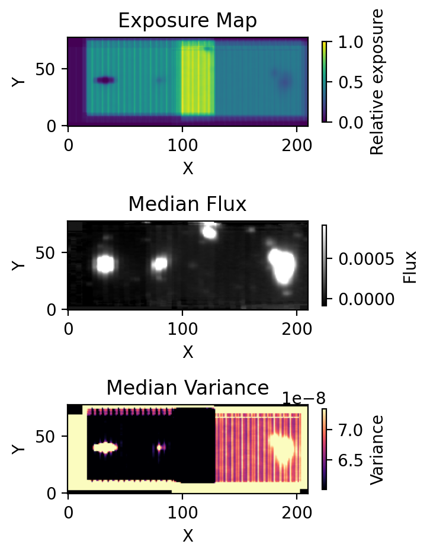

## Coaddition (Red)

After sky subtraction, the red-channel data cubes are coadded onto a common spatial grid, following the same procedure as:

**[Coaddition (Blue)](step5_coadd_blue.md)**

This includes:
- WCS alignment and grid construction  
- interpolation and flux accumulation  
- variance propagation  
- sparse covariance tracking  

---

### Key Difference: Cosmic Ray Masking

The red-channel coaddition explicitly incorporates **cosmic ray (CR) masking**.

Each cube is accompanied by a CR mask, and masked pixels are treated as **missing data** during coaddition. As a result:

- flux is accumulated only from **unmasked pixels**  
- effective exposure becomes **wavelength-dependent**  
- normalization uses a per-voxel exposure (`t_exp_tot`) rather than a 2D map  

This is the main difference from the blue pipeline and is essential for:
- removing CR contamination  
- preserving correct noise properties  
- properly weighting partially masked data  

---

### Run Coaddition

```
python run_coadd_red.py
```

---

### User Configuration

```python
PRODUCT = "sky2"   # or "sky"
PA = 125
PX_THRESH = 0.1
```

---

### Grouping and Selection

```python
GROUP_SUFFIXES_TO_RUN = ["a"]
OFFSETS_TO_RUN = ["offset2", "offset3"]
FIELDS_TO_EXCLUDE = []
FILES_TO_EXCLUDE = ["kr240208_00106", "kr231022_00188"]
```

Each group is coadded independently.

---

### Inputs

- Sky-subtracted cubes:

```
*_icubes.wc.c.sky.cr.sky.cr.sky.fits
*_icubes.wc.c.sky.cr.sky2.cr.sky2.fits
```

- CR masks:

```
*_icubes.wc.c.sky.cr.sky2.cr.fits
```

---

### Output

```
coadd/red/{group}/coadd_red_{group}_{PRODUCT}.fits
coadd/red/{group}/coadd_red_{group}_{PRODUCT}_var.fits
coadd/red/{group}/coadd_red_{group}_{PRODUCT}_cov_data.npy
coadd/red/{group}/coadd_red_{group}_{PRODUCT}_cov_coordinate.npy
```

---

### Diagnostic Plots

```
coadd/red/{group}/coadd_red_{group}_{PRODUCT}_diagnostics.png
```

Includes:
1. Exposure map  
2. Median flux map  
3. Median variance map  

Example:



The median flux map indicates that **cosmic rays are effectively suppressed** in the coadd.  
Users are encouraged to inspect the white-band images and diagnostic plots prior to further analysis, as these provide a more direct assessment of masking quality and residual artifacts.  

Small residual features may still appear near the **edges**, where the exposure coverage is lower.

---

### Notes

- Same framework as blue coaddition, with CR-aware weighting  
- Exposure is **non-uniform in wavelength** due to masking  
- Covariance tracking remains essential  
- This step produces the **final science-ready cube**