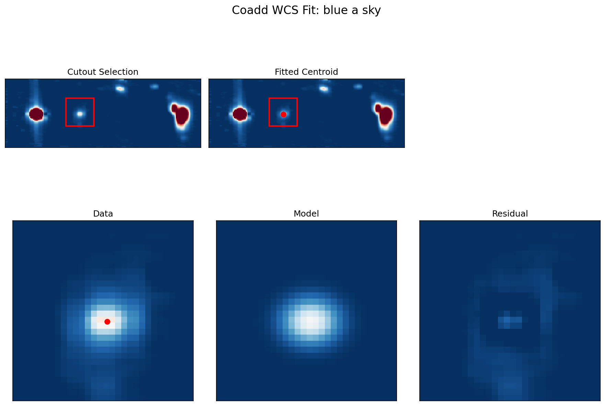

# Coadd WCS Correction

## Overview

This step refines the astrometric solution of the coadded cube by anchoring it to a known sky reference source.

Although optional, it is **strongly recommended** to ensure that the final coadded data are accurately aligned in world coordinates (RA, Dec).

---

## Motivation

Small astrometric offsets can remain after individual cube alignment and coaddition due to:

- residual WCS inaccuracies in input exposures  
- interpolation and resampling during coaddition  
- slight centroid shifts between exposures  

If uncorrected, these offsets can lead to:

- misalignment with external datasets (e.g., SDSS, HST)  
- incorrect spatial interpretation of structures  
- degraded stacking or comparison across bands  

This step ensures that the coadded cube is **anchored to an absolute sky coordinate system**.

---

## Principle

A reference continuum source with known sky coordinates is identified in the coadded cube.

We:

1. Collapse the cube over selected wavelength ranges  
2. Fit a 2D Gaussian to the source  
3. Determine its centroid in pixel coordinates  
4. Assign the known RA/Dec to that centroid  

This updates the WCS via:

$$ \mathrm{CRVAL1, CRVAL2} \rightarrow (\mathrm{RA}, \mathrm{Dec}) $$

$$ \mathrm{CRPIX1, CRPIX2} \rightarrow (x_{\mathrm{ref}}, y_{\mathrm{ref}}) $$

---

## Procedure

1. **Wavelength collapse**

   The cube is summed over selected wavelength ranges to enhance continuum signal while avoiding strong emission lines.

2. **Source selection**

   A cutout region is defined around a known reference source.

3. **2D Gaussian fit**

   The source is fit with a Gaussian + constant background model to determine the centroid.

4. **WCS update**

   The fitted centroid is assigned the known sky coordinates, updating:

   - CRVAL1 / CRVAL2 (world coordinates)
   - CRPIX1 / CRPIX2 (reference pixel)

5. **Propagation**

   The updated WCS is applied consistently to:

   - Flux cube  
   - Variance cube  
   - Any associated coadd products  

---

## Running the Correction

Run:

```bash
python run_wcs_coadd.py
```

This script:

- fits the reference source on the coadded flux cube  
- computes the corrected WCS solution  
- writes WCS-corrected FITS files  

---
## Configuration

Key parameters in run_wcs_coadd.py:

```python
# Reference sky coordinates (e.g., from SDSS)
RA_DEG = ...
DEC_DEG = ...

# Wavelength ranges for continuum collapse
WAVELENGTH_RANGES = [
    (3700, 3980),
    (4800, 5100),
]

# Cutout region (pixel coordinates)
ROW_START = ...
COL_START = ...
N_ROWS = ...
N_COLS = ...

# Initial Gaussian guesses (cutout coordinates)
AMPLITUDE_INIT = ...
X_MEAN_INIT = ...
Y_MEAN_INIT = ...
X_STDDEV_INIT = ...
Y_STDDEV_INIT = ...
```

---
## Output

The pipeline produces:

1. **WCS-Corrected FITS Files**
   - `coadd_*.wc.fits` → flux cube with updated WCS  
   - `coadd_*_var.wc.fits` → variance cube with matching WCS  

   All associated products share a consistent astrometric solution.

2. **Diagnostic Output**
   - WCS fitting diagnostic plot (PNG)  
   - Visualization of cutout selection, centroid location, and model fit  

   This is similar to the single-exposure WCS correction step and is used to verify the quality of the fit.

---

## Example



The diagnostic figure shows:

- **Top left**: collapsed image with selected cutout region  
- **Top middle**: fitted centroid overlaid on the image  
- **Bottom row**: data, model, and residual of the Gaussian fit  

A good result is characterized by:

- a well-centered Gaussian fit  
- small, structure-free residuals  
- centroid aligned with the expected source position  

This confirms that the WCS solution is reliable.

---

## Sanity Checks

After running the correction, verify the astrometry visually:

- Open the WCS-corrected FITS cube in DS9 (or similar viewer)  
- Overlay external imaging or catalog coordinates (e.g., SDSS)  
- Confirm that the reference source is centered at the expected sky position  

Additional checks:

- The fitted centroid lies within the selected cutout region  
- The Gaussian model closely matches the data (no strong asymmetries)  
- Residuals are noise-like without large-scale structure  

If these checks fail, revisit:
- cutout selection  
- wavelength ranges  
- initial Gaussian parameters  
- reference source identification  