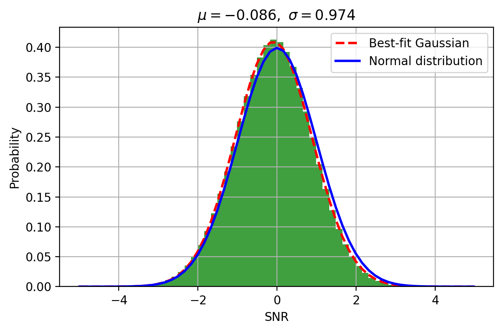

# Variance Normalization

## Overview

This step corrects the overall normalization of the noise in the coadded cube by ensuring that the signal-to-noise ratio (SNR) distribution is statistically consistent.

Although optional, it is **recommended** to account for small systematic biases in the variance (e.g., from the KCWI DRP).

---

## Principle

In blank-sky regions, the SNR distribution should satisfy:

$$
\sigma_{\mathrm{SNR}} \approx 1
$$

If the measured width is:

$$
\sigma_{\mathrm{SNR}} = s
$$

a global correction is applied:

$$
\mathrm{Var} \rightarrow s^2 \cdot \mathrm{Var}
$$

and similarly for the covariance.

---

## Procedure

- Select blank-sky wavelength ranges  
- Mask sources via sigma clipping  
- Compute the SNR distribution  
- Fit a Gaussian to measure $\sigma_{\mathrm{SNR}}$  
- Rescale variance and covariance by $\sigma_{\mathrm{SNR}}^2$  

---

## Running the Step

```text
python run_variance_normalization.py
```
---

## Configuration

Users can adjust key parameters in `run_variance_normalization.py`:

```text
CHANNEL = "blue"
GROUP = "a"
PRODUCT = "sky"

WAVELENGTH_RANGES = [
    (3700, 4000),
    (4800, 5100),
]
```

---

## Output

- Updated files:
  - `coadd_*_var.wc.fits`
  - `coadd_*_cov_data.npy`

- Backup files:
  - `*_old.fits`
  - `*_old.npy`

- Diagnostic plot:
  - `*_variance_normalization.png`

  ---

## Example




---
## Interpretation

- σ ≈ 1 → correct normalization  
- σ > 1 → variance underestimated  
- σ < 1 → variance overestimated  

In practice, we find that the KCWI DRP tends to slightly **overestimate the noise**, typically giving σ ≈ 0.8–0.9. This step corrects for that bias.